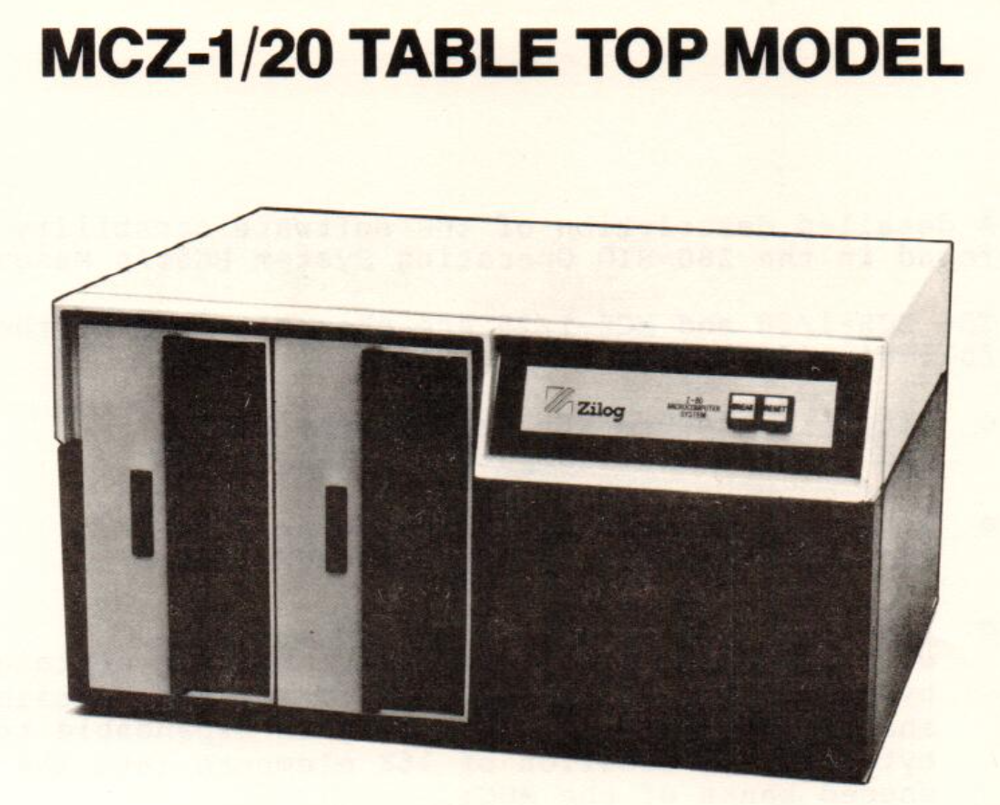
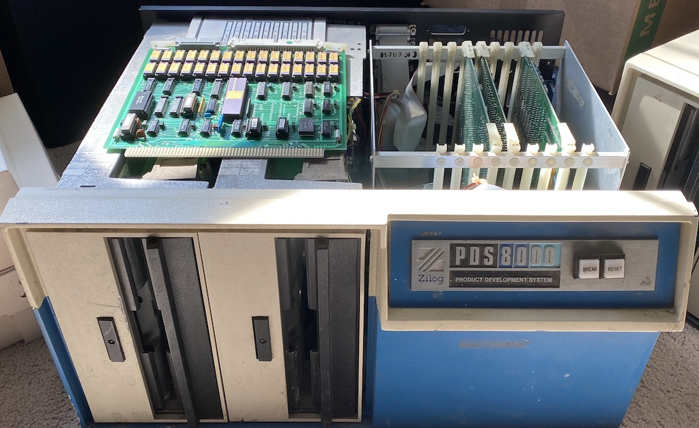
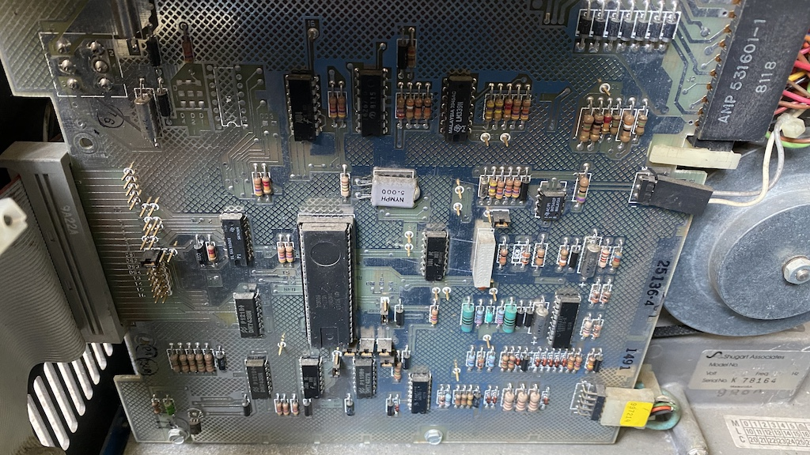
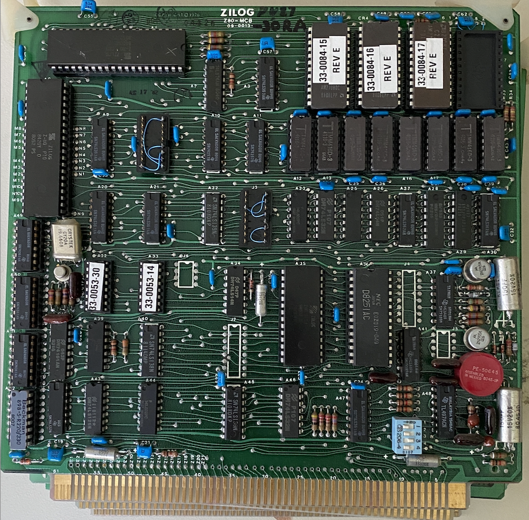
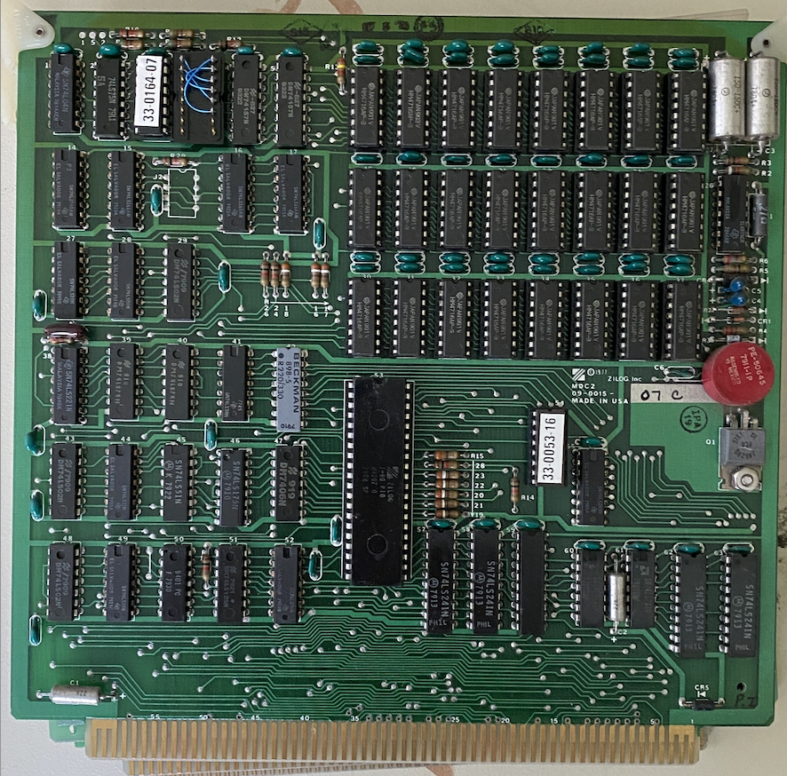
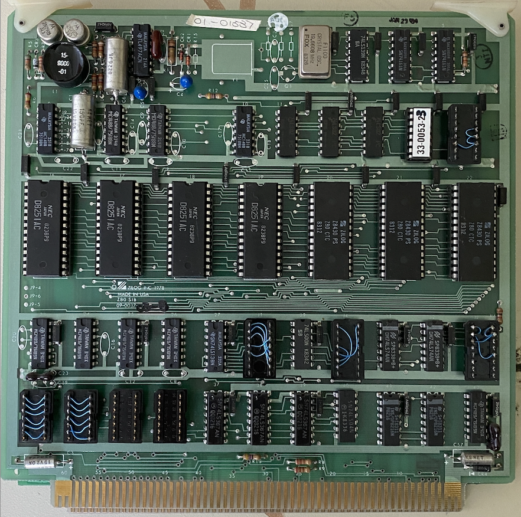
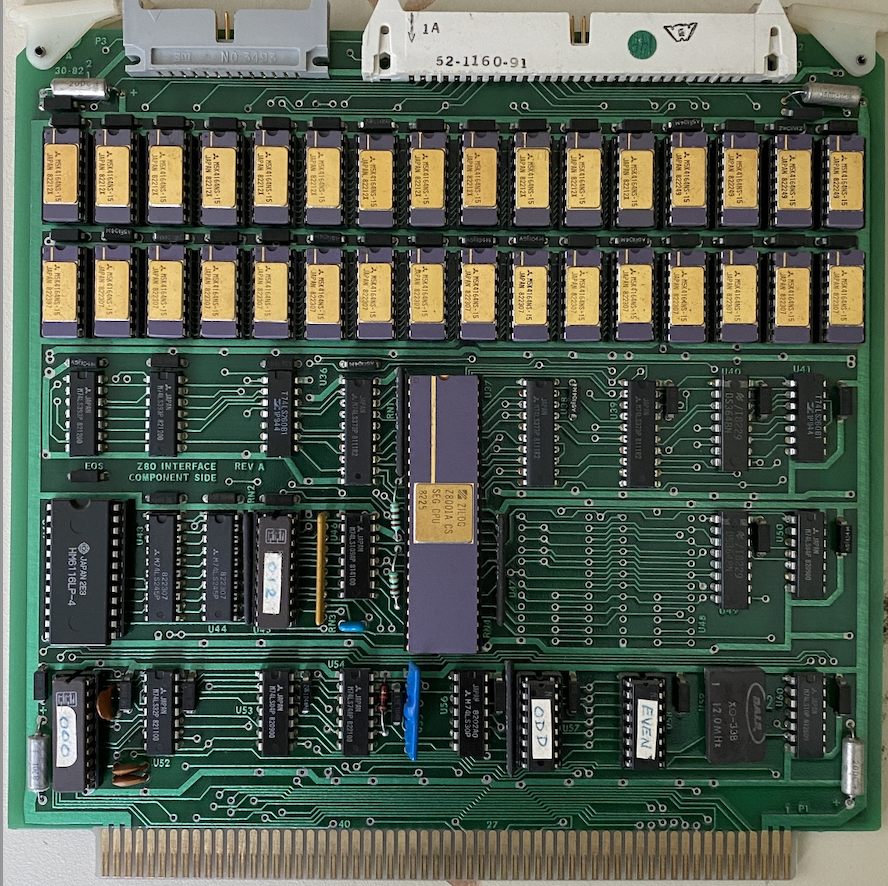
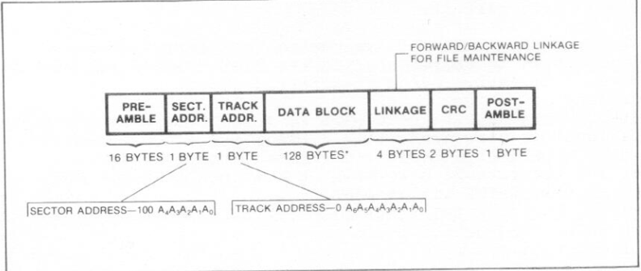

# ZILOG MCZ 8 BIT COMPUTERS

  
  
Front view with installed cards (right to left: MCB,MDC2,SIB - note the required slot locations for each card)  
  
  
Drive 1 board configuration (addressed as drive **0** in the RIO OS)  
  
  
Drive 2 board configuration (addressed as drive **2** in the RIO OS - note the 4 terminator jumpers)  
  
  
MCB cpu board (required for functional system)  
  
  
MDC floppy disk controller with 48K RAM (required for functional system)  
  
  
SIB multi serial port board (optional)  
  
  
Z8000 development board (optional)  
  
  
# DOCUMENTATION
  
[MCZ-1/20 Hardware Users Manual](docs/03-0018-02_MCZ-1_20_25_Hardware_Users_Manual.pdf)  
[MCZ-1/20 MCB Hardware Users Manual](docs/03-0007-03_Z80-MCB_Hardware_Users_Manual.pdf)  
[MCZ-1/20 MDC Hardware Reference Manual](docs/03-3006-02_Z-80_MDC_Hardware_Reference_Manual.pdf)  
[MCZ-1/20 FLOPPY PROM Users Guide](docs/03-3106-01A_MCZ-1_20A_and_MCZ-1_25A_Microcomputers_Floppy_Prom_User_Guide_Dec79.pdf)  
  
# RIO OPERATING SYSTEM
  
[RIO Operating System Users Guide](docs/03-0072-01A_Z80_RIO_Operating_System_Users_Manual_Sep78.pdf)  
[RIO Operating System Assembler Users Manual](docs/03-0073-00_Z80-RIO_Relocating_Assembler_and_Linker_Users_Manual.pdf)  
  
# SOFTWARE DISK IMAGES
**System Software**  (335KB)
- [13-1000-01 UNABRIDGED SYSTEM DISK](https://drive.google.com/file/d/1S8CdG0heZX6rx3Lu4Yhft_gOVtjvQO3g/view?usp=sharing)
- [13-3001-01 MCZ 1/05 1/20 1/25 1/30 RIO OPERATING SYSTEM](https://drive.google.com/file/d/1lxR58Ioxn_rV4gfGed1RWfSN5SNofkwC/view?usp=sharing)
- [13-3001-03 MCZ RIO 2.2 WITH MCZIMAGER AND BASIC](https://drive.google.com/file/d/1PvH10bllp8FezJ73ol3FloSkpHJ_Rezg/view?usp=sharing)
- [13-3001-03 MCZ/PDS RIO 2.2](https://drive.google.com/file/d/12AsWyJgidSBs8qwPeehfMdyAvEYc4_Nv/view?usp=sharing)
- [13-3309-05 MCZ/PDS FLOPPY DISK Z8000 SDP 3.0](https://drive.google.com/file/d/1dPCjObwaHzy8frUUW2HsT1oG9Zo23pXo/view?usp=sharing)
- [13-3361-06 MCZ/PDS FLOPPY DISK Z8 SDP 4.0](https://drive.google.com/file/d/1NoaU3jMIE_HGKojCwaUJ6-3J85oi17aZ/view?usp=sharing)
- [13-3391-03 ASYNC MCZ 1/PDS FD SYSTEM REL 1.1](https://drive.google.com/file/d/1j5vn7_MgA3J5fTIL2R7T6lwrLziEWqBq/view?usp=sharing)
- [RIO 2.2 PDS8000 MCZ 1/20 SYSTEM DISK](https://drive.google.com/file/d/1GXXkUx8c5iuZNeWE2ZX732U0AsFuD3TK/view?usp=sharing)
- [SYSTEM (DEV SOFTWARE FOR Z8000 - 1 OF 4)](https://drive.google.com/file/d/1Dcsd-38Wq5MzV1vkYWjHhNE3PtAXvzvR/view?usp=sharing)
- [SYSTEM (DEV SOFTWARE FOR Z8000 - 2 OF 4)](https://drive.google.com/file/d/1fTGEOyvsGMFwBxHb-6tkocO4zJlBHH7O/view?usp=sharing)
- [SYSTEM (DEV SOFTWARE FOR Z8000 - 3 OF 4)](https://drive.google.com/file/d/17OHB0qkfkceu39YZDeohybeWXgP_rd6d/view?usp=sharing)
- [SYSTEM (DEV SOFTWARE FOR Z8000 - 4 OF 4)](https://drive.google.com/file/d/1J8_X7wnGGqapTyQAjRGW7n-IMwLiRBfC/view?usp=sharing)
- [Z8000 ASM](https://drive.google.com/file/d/1DcKXiebNaZmLAqRVR2I8HIPpLGz2e5Ds/view?usp=sharing)
- [Z8000 BACKUP](https://drive.google.com/file/d/1ju-9qQ9mMlZd72wH3_2eotzPv3F93HAT/view?usp=sharing)
- [Z8000 DEV MODULE SOURCE](https://drive.google.com/file/d/1CRevT1DjZgiZUNM5yZnOlTRbYYkOP71m/view?usp=sharing)
- [Z8000 DEV MODULE](https://drive.google.com/file/d/1kuacpstJnPm3lpgMFJbeiQ7lnvP4F5DP/view?usp=sharing)

# DISK IMAGING SOFTWARE
Disk images are saved in the **MCZ disk format**. The format is defined as follows:  
Sector: **(1 byte sector number) (1 byte track number) (128 bytes data) (2 byte back ptr) (2 byte fwd ptr) (2 byte crc)** (136 bytes)  
(**NOTE**: Sector number always has the high bit set. It is the start bit marker so the hardware, after reading all zeros in the preamble,  
  can detect the start of data. So sector 0 will actually be 80H and sector 31 will be 9FH on the disk. This is followed by the track  
  number ranging from 0 to 76)  
One track: 32 sectors (4,352 bytes)  
One disk: 77 tracks (335,104 bytes)  
  
**Host software executables:**  
[Host Software for OS X](https://drive.google.com/file/d/1vN9gfXpg1oHRtHYmax2SpriUPYqASEiV/view?usp=sharing)  
[Host Software for Windows x64](https://drive.google.com/file/d/13KzslJgTaaXtDMLhdkHzPB4BdWDIiiaX/view?usp=sharing)  
[Host Software for Linux x64](https://drive.google.com/file/d/1b-9KkMlEc3CboC27UF4KFiXcicf9oaLZ/view?usp=sharing)  
  
**Host software source code:**  
[Host Software Unity C# Source Code](https://drive.google.com/file/d/1il-U8H9HPVprYwmn-_M73DYB2V7kkWYj/view?usp=sharing)  
**How to build the host software:**  
- Built on top of my Heathkit H19 terminal emulator (included)
- Unzip the file to a folder
- Download Unity 2020.3.7f1
- Point Unity to folder and load Assets/H19/Scenes/main.unity
- MCZImagerHost source code is in Assets/MCZImager/Code/MCZImager.cs  
  
[MCZIMAGER.S Z80 Assembly Language Source File](software/MCZIMAGER.S)  
This is the Zilog MCZ side of the imaging software - it handles reading/writing the disks. When clicking on **SEND IMAGER**
in the host software it will upload the MCZIMAGER Z80 hex code byte by byte to the MCZ debug console and when done the
MCZIMAGER will be launched automatically. This allows a system with no boot disk to be able to receive a RIO boot disk image
and write it to a floppy disk so that the system can be booted.  
  
The host software has a built-in Heathkit H19 terminal emulator for connecting to the MCZ computer. Just plug
in your host computer to the terminal port of the MCZ computer via a USB to serial port cable then choose to connect
using the USB serial port device. You should now be able to type in commands and receive text from the MCZ computer.  
  
**How to use the MCZIMAGER software:**
1. (HOST) Launch the MCZImagerHOST software and connect via USB serial port to the MCZ computer
2. (MCZ) Turn on your MCZ computer and press RESET until you see the debug console prompt '>'
3. (HOST) Turn off Safe Mode in the MCZImager HOST software (uncheck the box)
4. (HOST) Click the "SEND IMAGER" button and click "OK" on the notification panel
5. (HOST) The host software will begin to "type" in the hex code for the MCZImager and then it will execute the program on the MCZ computer
6. (MCZ) Make sure there is a blank disk in drive 0 of the MCZ computer
7. (HOST) Click the "SEND IMG" button then choose a RIO OS disk image (download from above)
8. (HOST) Click OK on the warning panel that the disk in drive 0 will be overwritten
9. (MCZ) When done uploading and writing the disk image to the floppy drive you can now press RESET and press ENTER to boot to the RIO OS
  
**To build the MCZImager program on the MCZ computer:**
1. (HOST) Launch the MCZImagerHOST software
2. (MCZ) Boot your MCZ computer to RIO
3. (MCZ) At the RIO prompt (%) type "EDIT MCZIMAGER.S"
4. (MCZ) You should see a notification that a new file is being edited
5. (HOST) From the HOST software click on "SEND TXT" and choose the MCZIMAGER.S ASM source file (from above link)
6. (HOST) The HOST will begin "typing" in the source file into the MCZ line editor
7. (MCZ) When done press ENTER and you should see the editor prompt ">"
8. (MCZ) Now type "QUIT" at the editor prompt to write the file to disk
9. (MCZ) At the RIO prompt (%) type: ASM MCZIMAGER.S
10. (MCZ) The Z80 Assembler will begin compiling the source file into object code
11. (MCZ) When done it should report "0 errors"
12. (MCZ) At the RIO prompt (%) type: LINK $=4400 MCZIMAGER
13. (MCZ) Now the linker will begin creating an executable program called MCZIMAGER
14. (MCZ) When done you should now have a program called MCZIMAGER on your MCZ system disk
15. (MCZ) At the RIO prompt (%) type: MCZIMAGER
16. (HOST) Create a disk image of your system disk by clicking on the "READ IMG" button
17. (HOST) Each track of the disk in drive 0 will begin to transfer to the HOST
18. (HOST) When the last track is transferred save the file to your desktop
  
  
**To WRITE an image to a floppy disk:**
1. (MCZ) Launch MCZIMAGER on the MCZ computer if it is not already running
2. (MCZ) Remove the disk from drive 0 (so it does not get overwritten)
3. (MCZ) Insert a blank RIO formatted disk in drive 0
4. (HOST) On the HOST click on the SEND IMG button
5. (HOST) Choose a disk image to transfer to the MCZ computer
6. (HOST) When a file is selected the track-by-track transfer will begin
7. (MCZ) When done the disk in drive 0 will contain the contents of the disk image file
  
- 7/3/2021 working disk imaging solution
- 7/3/2021 can create a bootable disk on a system with no access to software  
- As of 6/24/2021 I can read disks and create digital copies including back/forward file pointers
- As of 6/24/2021 I can write disk images to a floppy on the MCZ system
- Imager currently uses MCZ terminal serial port to send/receive disk images (no other serial port is needed)
- Host software is written in Unity C# so can port to pretty much all platforms (Linux, OSX, PC)

Contact Me @ <lesbird65@gmail.com>  
  
# DEV NOTES
**Some of the problems I had to solve while developing the imager software**
  
**READ FROM TERMINAL PORT**  
```asm
SERDAT:	EQU	0DEH
SERCON:	EQU	0DFH
RXRDY:	EQU	1

TTYIN:  IN 	A,(SERCON)
	BIT	RXRDY,A
	JR	Z,TTYIN		; NOT READY YET.
	IN	A,(SERDAT)
```  
  
**WRITE TO TERMINAL PORT**  
```asm
SERDAT:	EQU	0DEH
SERCON:	EQU	0DFH
TXRDY:  EQU 0

TTYOUT:	
	PUSH	AF
TTYOU1:
	IN	A,(SERCON)
	BIT	TXRDY,A
	JR	Z,TTYOU1
	POP	AF
	OUT	(SERDAT),A
```


  
**READ A SECTOR**  
```asm
RD_DAT  EQU     04H
TIM256  EQU     61
DSKDAT	EQU	0CFH
DSKCOM	EQU	0D0H
DSSTAT	EQU	0D0H

RDSECT: LD	HL,(BFFADD)	; GET USER DATA AREA.
        PUSH	HL
        LD	HL,DS_BUF	; ADDRESS OF SECTOR ADDRESS.
        LD	A,RD_DAT	; PREPARE TO TURN ON READ AMP.
        LD	B,TIM256

;       175 T-STATES FROM INTERRUPT

        DJNZ	$		; TIME OUT
        OUT	(DSKCOM),A
        LD	BC,8000H+DSKDAT	; 128 BYTES OF SECTOR DATA

; 400 USECS FROM INTERRUPT

        IN	A,(DSKDAT)	; INPUT SECTOR ADDRESS.
        CP	(HL)		; COMPARE IT.
        POP	HL		; GET DATA ADDRESS.
        IN	A,(DSKDAT)	; INPUT TRACK ADDRESS.
        JP	NZ,WRNGSC
READIT: INI			; READ 80H BYTES OF DATA
        NOP
        NOP
        NOP
        JR	NZ,READIT
        LD	HL,PTRS		; INPUT THE POINTERS.
        INI
        LD	B,5
        INIR
        IN	A,(DSSTAT)	; CHECK FOR CRC ERROR.
        BIT	CRC,A
        LD	A,B		; SET A TO ZERO TO
        OUT	(DSKCOM),A	; TURN OFF READ.
        JR	NZ,BADCRC
```
  
**WRITE A SECTOR**
```asm
WRCRC   EQU     18H
TIM512  EQU     73
DSKDAT	EQU	0CFH
DSKCOM	EQU	0D0H
DSSTAT	EQU	0D0H

WRTOK: 	LD	BC,8200H+DSKDAT
        LD	HL,(BFFADD)	; GET USER DATA ADDRESS.
        PUSH	HL
        LD	HL,DS_BUF	; ADDRESS OF SECTOR ADDRESS.
        LD	A,TIM512	; TIME OUT 512 USECS. FOR PREAMBLE.

; 229 T-STATES FROM INTERRUPT

        DEC	A
        JR	NZ,$-1

; 568 USECS FROM INTERRUPT

        OUTI
        OUTI
        POP	HL		; GET BACK DATA ADDRESS.
WRITIT: OUTI			; OUTPUT THE DATA.
        NOP			; INCREASE REFRESH RATE
        NOP
        NOP
        JR	NZ,WRITIT
        LD	HL,PTRS		; LOAD ADDRESS OF POINTERS.
        OUTI
        OUTI
        OUTI
        LD	A,WRCRC		; WRITE CRC ENABLE
        OUTI			; OUTPUT LAST POINTER
        OUT	(DSKCOM),A	; ENABLE CRC
        OUT	(DSKDAT),A	; OUTPUT TWO CRC WORDS.
        OUT	(DSKDAT),A
        XOR	A		; CLEAR A
        OUT	(DSKDAT),A
        OUT	(DSKDAT),A
        OUT	(DSKCOM),A
        JR	FINOP
```
  
**READ A TRACK USING PROM ROUTINES**
```asm
FLOPPY:	EQU	0BFDH
PTRS:	EQU	12B4H
;
DATA:	DEFS	1100H		; ROOM FOR ENTIRE TRACK INCLUDING PTRS
;
SCVEC:
SCLUN:	DEFB	0
SCREQ:	DEFB	0AH		; READ BINARY
SCDTA:	DEFW	DATA
SCDL:	DEFW	128
SCCRA:	DEFW	0
SCERA:	DEFW	0
SCCC:	DEFB	0
SCSEC:	DEFB	0
SCTRK:	DEFB	0
;
; PROM READ ENTIRE TRACK (32 SECTORS)
; READS ONE SECTOR AT A TIME THEN GRABS PTR VALUES
;
READ3:
	LD	A,0AH
	LD	(SCREQ),A	; BINARY READ
	XOR	A
	LD	(SCTRK),A	; THE TRACK TO READ
READ4:
	XOR	A
	LD	(SCSEC),A	; START WITH SECTOR 0
	LD	HL,DATA
	LD	(SCDTA),HL	; STORE TRACK IN DATA BUFFER
; READ 32 SECTORS USING PROM
	PUSH	HL
	CALL	RDTRK7		; READS 32 SECTORS
	POP	HL
;
; DO SOMETHING WITH THE DATA HERE
;
	LD	A,(SCTRK)
	INC	A
	LD	(SCTRK),A	; SET UP TO READ NEXT TRACK
	CP	77
	JR	NZ,READ4	; LOOP IF NOT LAST TRACK
	RET			; DONE WITH DISK
;
; READ 32 SECTORS AND STORE IN DATA BUFFER
; ONE SECTOR: SECTOR (1 BYTE),TRACK (1 BYTE),DATA (128 BYTES),BCK (2 BYTES),FWD (2 BYTES),CRC (2 BYTES)
;
RDTRK7:
	LD	A,(SCSEC)
	OR	80H
	LD	(HL),A		; PUT SECTOR IN DATA (80H THRU 9FH)
	INC	HL
	LD	A,(SCTRK)
	LD	(HL),A		; PUT TRACK IN DATA (0 THRU 76)
	INC	HL
	PUSH	HL
	LD	(SCDTA),HL	; STORE THE TRACK DATA HERE
	LD	HL,128		; READ A FULL SECTOR (128 BYTES)
	LD	(SCDL),HL
	LD	IY,SCVEC
	CALL	FLOPPY		; READ DATA VIA PROM FUNCTIONS
	POP	HL
	LD	DE,128
	ADD	HL,DE		; ADVANCE DATA POINTER
	LD	DE,PTRS		; BCK/FWD POINTERS ARE STORED HERE
	LD	A,(DE)		; GET BCK1
	INC	DE
	LD	(HL),A		; PUT BCK1
	INC	HL
	LD	A,(DE)		; GET BCK2
	INC	DE
	LD	(HL),A		; PUT BCK2
	INC	HL
	LD	A,(DE)		; GET FWD1
	INC	DE
	LD	(HL),A		; PUT FWD1
	INC	HL
	LD	A,(DE)		; GET FWD2
	INC	DE
	LD	(HL),A		; PUT FWD2
	INC	HL
	XOR	A
	LD	(HL),A		; CRC1 - NOT USED
	INC	HL
	LD	(HL),A		; CRC2 - NOT USED
	INC	HL
	LD	A,(SCSEC)
	INC	A
	LD	(SCSEC),A	; NEXT SECTOR
	CP	32
	JR	NZ,RDTRK7	; LOOP IF NOT LAST SECTOR
	RET
```
  
**SELECT/DE-SELECT DRIVE 0**
```asm
CLK0:	EQU	0D4H
RSTCLK:	EQU	00001011B
DSKSEL:	EQU	0D1H
;
; SELECT DISK 0
;
SELDSK:
	LD	A,RSTCLK
	OUT	(CLK0),A
	LD	A,0
	SET	3,A
	OUT	(DSKSEL),A
	RET
;
; DESELECT DISK 0
;
DESDSK:
	LD	A,RSTCLK
	OUT	(CLK0),A
	IN	A,(DSKSEL)	; FIND OUT WHICH DISK IS SELECTED.
	BIT	3,A		; SEE IF ANY DISK IS SELECTED.
	RET	Z
	AND	07H
	OUT	(DSKSEL),A	; DESELECT IT.
	RET
```
  
**STEP THE DRIVE HEAD IN/OUT**
```asm
DIRECT	EQU	0
HDSTEP	EQU	1
DSKCOM	EQU	0D0H
;
CURTRK:	DEFB	0
;
; STEP HEAD
;
HDSTP0:
	LD	B,0		; SET TO STEP TOWARDS TRACK 0
	JR	HDSTP3
HDSTP1:
	LD	A,(CURTRK)
	CP	76
	RET	Z
HDSTP2:
	INC	A
	LD	(CURTRK),A
	LD	B,0
	SET	DIRECT,B	; SET TO STEP TOWARDS TRACK 77
HDSTP3:
	LD	C,DSKCOM
	OUT	(C),B
	SET	HDSTEP,B
	OUT	(C),B		; OUTPUT THE STEP PULSE.
	EX	(SP),HL		; DELAY
	EX	(SP),HL
	RES	HDSTEP,B	; OUTPUT STEP TRAILING EDGE.
	OUT	(C),B
	CALL	HDDLY0		; DELAY BEFORE STEPPING AGAIN
	RET
;
; HEAD STEP DELAY
;
HDDLY0:
	LD	DE,0400H
HDDLY1:				; DELAY LOOP BEORE MOVE HEAD AGAIN
	DEC	DE
	LD	A,D
	OR	E
	JP	NZ,HDDLY1
	RET
```
  
**WAIT FOR INDEX AND SECTOR HOLE**
```asm
CLK0:	EQU	0D4H
CTRMOD:	EQU	11010111B
DSKVSL:	EQU	13D0H
INTPNT:	EQU	12AFH
;
SECFLG:	DEFB	0
;
SCVEC:
SCLUN:	DEFB	0
SCREQ:	DEFB	0AH		; READ BINARY
SCDTA:	DEFW	DATA
SCDL:	DEFW	128
SCCRA:	DEFW	0
SCERA:	DEFW	0
SCCC:	DEFB	0
SCSEC:	DEFB	0
SCTRK:	DEFB	0
;
; WAIT FOR INDEX HOLE
; HACKY BUT WORKS - PROBABLY SHOULD USE THE CTC FOR THIS.
; I INCREMENT BC UNTIL A SECTOR HOLE INTERRUPT THEN CHECK
; THE HIGH BYTE (B) TO SEE HOW HIGH IT COUNTED. IF LESS
; THAN 01H THEN IT IS AN INDEX MARKER OTHERWISE A SECTOR
; MARKER
;
; 5 MS PER SECTOR HOLE
; O...O...O...O.I.O...O...O...O...ETC
;28  29  30  31 ^ 0   1   2   3
;
WAIDX:
	CALL	WASEC		; WAIT AT LEAST ONE SECTOR
WAIDX1:
	LD	DE,SECFLG
;
	XOR	A
	LD	(SECFLG),A
	LD	(SCCC),A
;
	LD	HL,SCVEC
	LD	(DSKVSL),HL
;
	LD	A,CTRMOD	; INTERRUPT AT NEXT SECTOR.
	OUT	(CLK0),A
	LD	A,1
	OUT	(CLK0),A
	LD	HL,INTSEC	; JUMP HERE WHEN SECTOR HOLE INTERRUPT
	LD	(INTPNT),HL
	LD	BC,0
WAIDX2:
	INC	BC		; COUNT UP UNTIL SECTOR HOLE DETECTED
	LD	A,(DE)
	OR	A
	JR	Z,WAIDX2
	LD	A,B		; TEST HIGH BYTE OF COUNTER
	CP	01H		; LESS THAN 01H IS AN INDEX MARKER
	JR	NC,WAIDX1
; INDEX HOLE LOCATED
	LD	HL,0
	LD	(DSKVSL),HL
	RET
;
INTSEC:
	LD	A,80H
	LD	(SECFLG),A	; SECTOR DETECTED FLAG
	LD	(SCCC),A	; INTERRUPT SUCCESS FLAG
	RET
;
; WAIT FOR SECTOR HOLE
;
WASEC:
	LD	DE,SECFLG
;
	XOR	A
	LD	(SECFLG),A
	LD	(SCCC),A
;
	LD	HL,SCVEC
	LD	(DSKVSL),HL
;
	LD	A,CTRMOD	; INTERRUPT AT NEXT SECTOR.
	OUT	(CLK0),A
	LD	A,1
	OUT	(CLK0),A
	LD	HL,INTSEC
	LD	(INTPNT),HL
; LOOP UNTIL SECTOR FLAG IS SET
WASEC1:
	LD	A,(DE)
	OR	A
	JR	Z,WASEC1
;
	LD	HL,0
	LD	(DSKVSL),HL
	RET
```
  

**MCZ PROM LISTING**  
[MCZ PROM SOURCE LISTING](src/MCZ.PROM.78089.L)  
[MCZ PROM SOURCE CODE](src/MCZ.PROM.78089.S)  
  
More info about **Zilog MCZ** systems can be found at the following links:  
[Herb Johnson's retrotechnology.com](https://www.retrotechnology.com/restore/zilog.html)  
[Vintage Computer Exhibit Canada](https://vintagecomputer.ca/zilog-z80-development-system/)  
[RIO & PLZ reloaded](http://rio.early8bitz.de/index.htm)  

